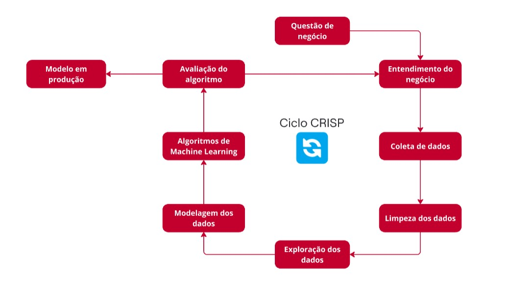
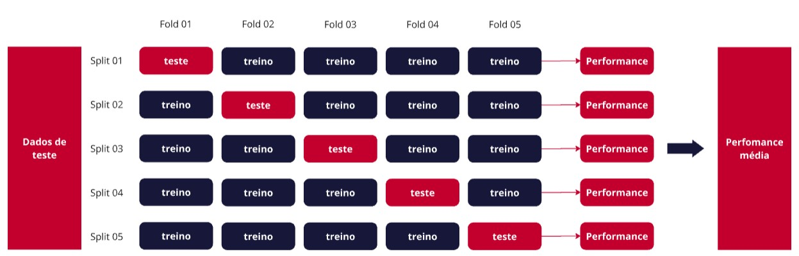

# Previsão de Vendas - Drogaria Rossmann

## 📲 Resultado

Qualquer pessoa conectada à um dispositivo com internet pode acessar via api a previsão de faturamento de seis semanas de qualquer loja Rossmann, em tempo real, através de um bot no Telegram.

## 💼 Contexto de Negócio

A Rossmann é uma das maiores redes de drogaria da Europa, com cerca de 56.200 funcionários e mais de 4.000 lojas. O CFO pretende reformar as lojas e precisa da previsão de vendas das próximas seis semanas de cada uma delas para gerenciar o orçamento disponível. A previsão é baseada em dados históricos de vendas e permite ao CFO e demais executivos acessarem previsões precisas, de forma prática e em tempo real.

## 📈 Objetivo do Projeto

O objetivo principal é fornecer ao CFO previsões de vendas confiáveis para cada loja da rede Rossmann. Atualmente, as previsões são feitas por gerentes individuais, gerando variações e incertezas. Esta solução ajudará na definição de orçamentos mais precisos para investimentos e reformas nas lojas, além de ser acessível em dispositivos móveis, permitindo consultas de qualquer local.

## 📋 Planejamento

Aplicação do ciclo CRISP (Cross-Industry Process) focado em Ciência de Dados como uma técnica de metodologia ágil para entrega de um projeto end-to-end de maneira rápida, analisando os dados disponíveis para mapear todos os possíveis problemas de negócio nas diferentes etapas do projeto e entregar valor rápido para os stakeholders.

## 🚀 Tecnologias Utilizadas

- **Linguagem**: Python 3.11.4
- **Bibliotecas**: Scikit-learn, Pandas, Numpy, Matplotlib, Boruta, Flask, inflection, Seaborn, XGBoost
- **Versionamento**: Git
- **Plataforma de Deployment**: Serviço Web da Heroku para uso em dispositivos móveis

## 📊 Etapas do Projeto

1. **Entendimento do Negócio**: Quem é o dono do problema? Entendimento do contexto e da causa raiz. Entender o formato da solução (Granularidade, Tipo do problema como classificação, previsão ou clusterização e Formato da entrega).
2. **Coleta e Limpeza de Dados**: Obtenção de dados públicos reais no Kaggle, tratados e interpretados por estatística descritiva.
3. **Exploração de Dados**: Análise exploratória de dados para investigar padrões, entender fatores que influenciam o negócio e validar hipóteses.
4. **Modelagem de Dados**: Separação dos dados em treino, validação e teste, preparação dos dados (normalização, rescaling e encoding) e seleção de variáveis relevantes para o modelo.
5. **Algoritmo de Machine Learning**: Aplicação dos dados e variáveis aos algoritmos como Regressão Linear, Random Forest e XGBoost, com ajustes para minimizar erros de previsão.
6. **Avaliação de Resultados**: Avaliação com dados de teste e validação para garantir a qualidade e confiabilidade do modelo, calculando as métricas de performance e se o resultado faz sentido para o negócio.
7. **Implementação e Deployment**: Interface simples, acessível via dispositivos móveis.

## 💡 Principais Insights

### Competidores Próximos Aumentam as Vendas

Na análise entre as variáveis Vendas x Distância entre competidores, apesar da baixa correlação, farmácias Rossmann localizadas próximas umas das outras fazem com que as vendas aumentem de maneira geral.

### As lojas vendem menos aos finais de semana

Com alta correlação, aos finais de semana, especialmente aos domingos, há uma queda considerável nas vendas de produtos das lojas.

### As lojas vendem menos no segundo semestre do ano

De agosto a dezembro há uma queda em torno de 30% nas vendas em relação ao restante do ano.

## 🤖 Machine Learning

Foi utilizada a metodologia do cross-validation para achar a performance real do modelo, mitigando possíveis vieses temporais.

### Avaliação dos Modelos

Foram testados cinco modelos de machine learning, testando a linearidade dos dados até os mais complexos para explorar sua capacidade de ajuste:

- Average Model
- Linear Regression Model
- Linear Regression Lasso
- Random Forest Regresor
- XGBoost Regressor

| Model Name | MAE        | MAPE       | RMSE       |
|---|---|---|---|
| Random Forest Regressor | 836.61 +/- 217.1 | 0.12 +/- 0.02 | 1254.3 +/- 316.17 |
| XGBoost Regressor      | 1858.17 +/- 290.66	| 0.25 +/- 0.01	| 2686.29 +/- 432.14 |
| Linear Regression      | 2083.17 +/- 294.98	| 0.3 +/- 0.02	| 2958.87 +/- 466.72 |
| Linear Regression - Lasso | 2117.66 +/- 340.94 | 0.29 +/- 0.01 | 3061.89 +/- 503.23 |
| Average Model         | 1354.800353 | 0.206400   | 1835.135542 |

### Modelo Final

Após a otimização dos parâmetros, através do Random Search, foi adotado o modelo XGBoost, pelo bom desempenho e também pelo seu custo computacional e de armazenamento menor.

Assim, o resultado final do modelo adotado foi:

| Model Name | MAE        | MAPE       | RMSE       |
|---|---|---|---|
| XGBoost Regressor      | 663.329609 |	0.096535 | 975.273178 |

## 💲Performance de Negócio

Avaliando a soma das vendas de todas as lojas, temos uma variação de +- 0,3%. 
Para cada loja, o erro médio é de aproximadamente 10%.

| Cenários       | Valores               |
|---------------|-----------------------|
| Predições     | US$ 283,476,320.00     |
| Pior cenário | US$ 282,732,852.35     |
| Melhor cenário | US$ 284,219,747.87     |
|               |                       |

## 📌 Conclusão

Este projeto oferece uma ferramenta poderosa de previsões de vendas para a Rossmann, permitindo ao CFO tomar decisões estratégicas com mais segurança e precisão. 
A solução do problema, de forma prática e acessível, permite que com o código da loja seja previsto as vendas correspondentes.

## 🔎 Próximos Passos

Nos ciclos seguintes do CRISP pretendo implementar algumas melhorias como:

- Investigar erros nas lojas 292 e 909: analisar porque apresentam erros acima de 50% e encontrar soluções
- Novos modelos de Machine Learning: explorar outros algoritmos e identificar se algum deles oferece uma performance melhor
- Métodos de otimização de parâmetros: testar novas técnicas como Baesyan Optimization
- Automação de processos: aplicar a modelagem do scikit-learn no fluxo de trabalho para tornar o processo mais eficiente
